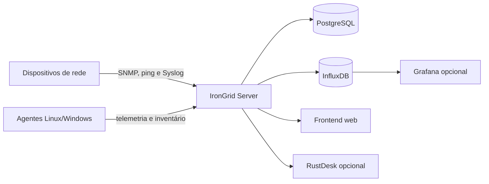

# IronGrid: monitoramento de infraestrutura e gerenciamento de redes

<p align="center">
  
</p>

<p align="center">
  <strong>Open source network monitoring, network inventory e IT infrastructure management para Linux e Docker.</strong>
</p>

<p align="center">
  <a href="https://github.com/sachelaride/IronGrid/actions/workflows/validate.yml"></a>
  <a href="https://github.com/sachelaride/IronGrid/blob/main/LICENSE"></a>
  <a href="https://hub.docker.com/r/sachelaride/irongrid-limited-369"></a>
</p>

O IronGrid é uma plataforma aberta para **monitoramento de dispositivos de
rede**, inventário de ativos e gestão operacional de ambientes de TI. Ele
centraliza switches, roteadores, servidores, firewalls, pontos de acesso e
outros equipamentos em uma interface web com execução em Linux ou Docker.

English summary: IronGrid is an **open source network monitoring and IT
infrastructure management platform** for Linux and Docker. It provides SNMP
monitoring, network inventory, discovery, dashboards, alerts and operational
tools for switches, routers, servers and other network devices.

## Recursos

- Monitoramento SNMP, ping, serviços e disponibilidade de dispositivos.
- Descoberta de rede, inventário de ativos e gerenciamento de endereços IP.
- Syslog, alertas, notificações e trilha de auditoria.
- Dashboards, métricas, relatórios PDF e integração com Grafana.
- Mapas de topologia e mapas personalizados.
- Gestão de agentes, tarefas agendadas, tickets e base de conhecimento.
- Execução centralizada com Docker ou instalação direta em Linux.
- Integração opcional com RustDesk para acesso remoto operacional.

## Demonstração e manuais

- [Manual principal online](https://sachelaride.github.io/IronGrid/index.html)
- [Manual online em português](https://sachelaride.github.io/IronGrid/Manual/index.html)
- [Manual online em inglês](https://sachelaride.github.io/IronGrid/Manual/index-en.html)
- [Imagem oficial no Docker Hub](https://hub.docker.com/r/sachelaride/irongrid-limited-369)
- [Releases e histórico de downloads](https://github.com/sachelaride/IronGrid/releases)

## Arquitetura



O servidor fornece a API e o frontend web. PostgreSQL armazena dados
operacionais, InfluxDB armazena métricas e Grafana/RustDesk podem ser ativados
conforme a necessidade da implantação.

## Instalação rápida com Docker

Requisitos: Docker Engine, Docker Compose V2 e portas livres para a instalação.

```bash
git clone https://github.com/sachelaride/IronGrid.git
cd IronGrid
cp .env.docker.example .env.docker
chmod 600 .env.docker
```

Edite `.env.docker` e gere valores exclusivos para `POSTGRES_PASSWORD`,
`INFLUX_INIT_PASSWORD`, `INFLUX_TOKEN`, `JWT_SECRET` e
`AGENT_INGEST_TOKEN`. Esses valores nunca devem ser enviados ao Git.

```bash
docker compose --env-file .env.docker up -d
docker compose --env-file .env.docker ps
docker compose --env-file .env.docker logs -f irongrid
```

A imagem publicada também pode ser baixada diretamente:

```bash
docker pull sachelaride/irongrid-limited-369:latest
```

## Instalação direta no Linux

Requisitos: Node.js 18 ou superior, npm, PostgreSQL e InfluxDB acessíveis pelo
host.

```bash
git clone https://github.com/sachelaride/IronGrid.git
cd IronGrid
npm ci
cp apps/server/.env.example apps/server/.env
cp apps/web/.env.example apps/web/.env
npm run build
./start_irongrid.sh
```

Consulte o [manual online](https://sachelaride.github.io/IronGrid/Manual/index.html)
para instalação e operação, e [CONTRIBUTING.md](CONTRIBUTING.md) para desenvolvimento.

## Exemplos de utilização

1. Configure as credenciais SNMP e execute a descoberta de uma faixa de rede.
2. Classifique os ativos encontrados como servidor, switch, roteador, firewall,
   câmera, impressora ou outro recurso.
3. Ative monitoramento, alarmes e notificações para os dispositivos críticos.
4. Consulte métricas, syslog, inventário e relatórios no painel web.
5. Publique dashboards complementares no Grafana quando necessário.

## Requisitos e escopo

O IronGrid é voltado para equipes de infraestrutura, redes, suporte e
operações de TI que precisam de **Linux infrastructure monitoring**, inventário
de dispositivos de rede e visibilidade operacional. As integrações externas
podem exigir configuração própria de rede, credenciais e permissões.

## Roadmap

Veja [ROADMAP.md](ROADMAP.md) para prioridades abertas. Sugestões devem ser
discutidas em [Issues](https://github.com/sachelaride/IronGrid/issues) ou
[Discussions](https://github.com/sachelaride/IronGrid/discussions) antes de
grandes alterações.

## Histórico de versões

O [CHANGELOG.md](CHANGELOG.md) resume as mudanças relevantes. Releases devem
conter os requisitos, hashes e arquivos distribuídos, sem `.env`, bancos,
backups ou chaves.

## Contribuição, apoio e licença

Contribuições de código, documentação, testes e feedback são bem-vindas.
Consulte [CONTRIBUTING.md](CONTRIBUTING.md) para usar Issues e Pull Requests
com revisão e aprovação.

O projeto é totalmente aberto sob a [GNU GPLv3 ou posterior](LICENSE). Apoio
financeiro é voluntário e ajuda a manter infraestrutura, correções e novas
melhorias; feedback técnico da comunidade é essencial para orientar o
desenvolvimento.
